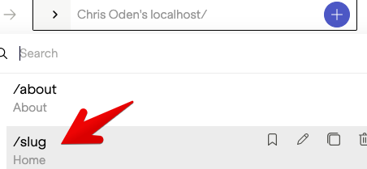

# Bugs/Issues

Notes:
- This branch is based off d2d8677de6a9b67c3c0808ff7c4163fea41fac83.  I see there have been
  updates since then, but unable to try with latest package versions since it' sunclear
  which version of @stackbit/cli to use.

1. ** FIXED ** Cannot create home page 
   - STR
     1. Delete all page content from `/content/pages`
     2. Try to create a page from SB UI
     3. Enter / as the slug (can't leave blank bc form does not validate)
   - ER: Page is created normally at `index.md`
   - AR: Page is not created with message "Encountered an error when trying to create a new Page"
   - Notes: If this is intended, then it is required that a developer create the first page entry
     in `/content/pages` - is that the intention?  Perhaps it would be better if this was created
     automatically using the default values.
2. Cannot move page
   - STR
     1. Restore page content
     2. Visit /about
   - ER: Slug field is exposed and user can move page by editing it
   - AR: No way to move page.
   - Notes: I see the `slug` field is commented out in the page model.  Is there another mechanism by
     which an editor can move a page?

3. ** FIXED ** Home page appears as '/slug' in nav when using directory based filePath
   - STR:
     - set filePath for Page as `'content/pages/{slug}/index.md`
     - rearrange existing data to match this pattern
       - /about.md -> /about/index.md
   - ER: Homepage shows in nav dropdown at path `/`
   - AR: Homepage shows in nav dropdown at path `/slug` - navigating there produces 404. No way
     to navigate to home page.
     

4. Constant fields are editable
   - STR
     - Add a new const field to page model:
       ```
        { type: 'string', name: 'const-field', label: 'Const Field', const: 'This is the value' },
        ```
      - Create a new page
  - ER: The field is not editable
  - AR: The field is editable.
  - Note: Also, for existing pages, the field is not populated with the const value.

5. Cannot create new data items
  - STR
      - Remove `content/data/amazing-spruce.json`
      - Run stackbit dev
      - Click on "Content" in sidebar
  - ER: You are able to add an entry of type "Author"
  - AR: You cannot add an entry of type "Author"
  - NOtes:
    - You can add a new author only if one already exists
    - Important to have this work also for "singleInstance" type data, to allow
      creation of (eg) site header, footer, etc.

6. Cannot provide default data for model field
  - STR:
    - Remove "footer" data from "config.json"
    - Add default footer data to config model (`Config.ts`)
  - ER
    - Default footer data shows up in site config editor in content tab of sitebar
    - Footer shows "Add footer configuration" with no default data.
  - Notes:
    - This *does* seem to work when creating a new item (see the defualt-data
      page). So this may ultimately be related to #5, and the problem is really
      that default field values are only used when a new item is created. This
      means that if I add a new field to model, there is no way to provide a
      default value for it that will apply to existing data.  This is problematic
      if I want to roll out such a change to a large number of sites.